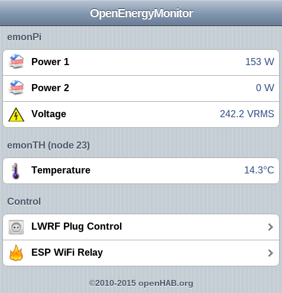

# OpenEnergyMonitor skeleton config for openHAB

To install openHab on Raspberry Pi:

Check Java version (JVM 1.6 or later is required):

	$ java - version
	
Install if needed:

	$ sudo apt-get install oracle-java7-jdk

Install OpenHab:

	$ wget -qO - 'https://bintray.com/user/downloadSubjectPublicKey?username=openhab' |sudo apt-key add -
	$ echo "deb http://dl.bintray.com/openhab/apt-repo stable main" | sudo tee /etc/apt/sources.list.d/openhab.list
	$ sudo apt-get update
	$ sudo apt-get install openhab-runtime
	$ sudo /etc/init.d/openhab start

To run openHab at startup:

	sudo update-rc.d openhab defaults
	sudo nano /etc/rc.local
	
add

	/etc/init.d/openhab start

before 'exit 0'

# Install MQTT & HTTP Bindings

Download openHAB addons (http://www.openhab.org/getting-started/downloads.html), unzip and extract. You probably want to do this on your PC since download .zip is over 80Mb then copy te required add on's

	sudo cp org.openhab.binding.mqtt-1.7.1.jar /etc/openhab/addons/
	sudo apt-get install openhab-addon-binding-mqtt
	
	sudo cp org.openhab.binding.http-1.7.1.jar /etc/openhab/addons/
	sudo apt-get install openhab-addon-binding-http

Install the OpenEnergyMonitor config files:

	$ git https://github.com/openenergymonitor/oem_openHab
	$ sudo ln -s /home/pi/oem_openHab/openhab.cfg /etc/openhab/configurations/
	$ sudo ln -s /home/pi/oem_openHab/oem.items /etc/openhab/configurations/items/oem.items
	$ sudo ln -s /home/pi/oem_openHab/oem.sitemap /etc/openhab/configurations/sitemaps/oem.sitemap
	$ sudo /etc/init.d/openhab restart

Then browse to:

	http://IP_ADDRESS:8080/openhab.app?sitemap=oem

You might need to open up the port:

	sudo iptables -A INPUT -p tcp -m tcp --dport 8080 -j ACCEPT

To save port rules use (you might also need to add entry in /etc/rc.local to open up port each time:

	sudo apt-get install iptables-persistent
	sudo nano /etc/iptables/rules.v4

	
# Enable Authentication

	sudo nano /etc/openhab/configurations/openhab.cfg
Change:
	security:option=ON or EXTERNAL for external from WAN security only

	sudo nano /etc/openhab/configurations/users.cfg
	
Add "user=password" e.g:

	pi = emonpi2015
	
# Read-only filesystem

If you want to run openHAB on emonPi with read-only file system you will need to mount /var/lib/openhab as tempfs in RAM
	
	$ sudo sh -c "echo 'tmpfs           /var/lib/openhab   tmpfs   nodev,nosuid,size=20M,mode=1777        0    0' >> /etc/fstab"
	
Also the correct ports will ned to be opend and RAM tmpfs log file created on startup. At the following to /etc/rc.local

# Debugging
		
To enable verbose debug mode cheange debug to 'yes' in: 

	sudo nano /etc/default/openhab
	
Note: it's not recomended to leave debug turned on by default as its very verbose and will fill up your logs! 

	
	sudo iptables -A INPUT -p tcp -m tcp --dport 8080 -j ACCEPT
	sudo mkdir /var/log/openhab
	sudo chmod 666 /var/log/openhab
	/etc/init.d/openhab start

